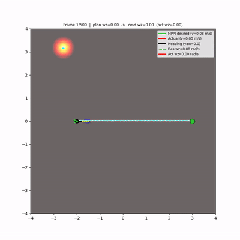
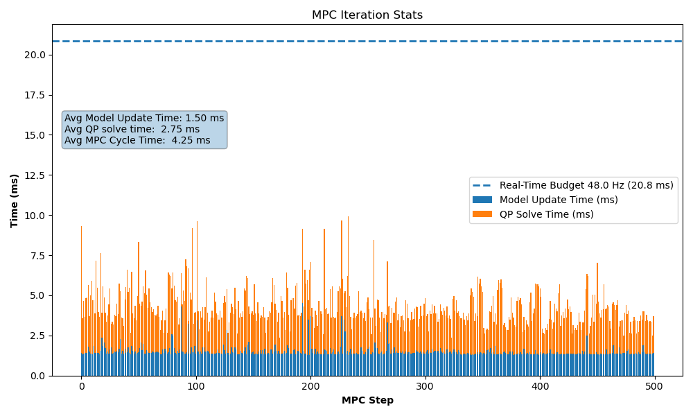
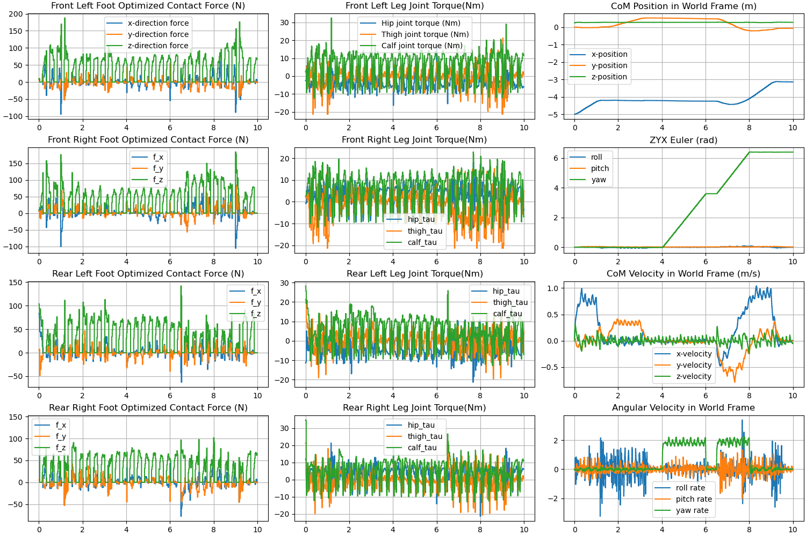

# MPPI Path Following with Foothold-Quality-Aware Cost for Quadruped Navigation

Hierarchical navigation framework for the **Unitree Go2** quadruped robot in **MuJoCo**, combining a terrain-aware global planner, a **Model Predictive Path Integral (MPPI)** local planner with a novel **Foothold-Quality-Aware (FQA)** critic, and a **Convex MPC** locomotion controller.

> **Note on Origins**: This codebase builds upon the open-source Convex MPC locomotion implementation from [elijah-waichong-chan/go2-convex-mpc](https://github.com/elijah-waichong-chan/go2-convex-mpc). Our work significantly extends this base by introducing a full hierarchical navigation stack (A* global planning + MPPI local planning) equipped with 3D Lidar perception, heightmaps, obstacle costmaps, and a novel Foothold-Quality-Aware (FQA) critic for unstructured terrain.

> **`examples/ex02_trot_forward.py` is the main entry point.** It runs the full navigation pipeline end-to-end: 3D lidar perception → heightmap → costmap → A\* global path → MPPI local planning (with FQA) → convex MPC locomotion.

<p align="center">
  
  <br/>
  <sub><b>Simulation Environments</b>: 3D Visualization (Left) and 2D MPPI Debug View (Right)</sub>
</p>

## Paper

The navigation system implements the methodology described in:

> **"MPPI Path Following with Foothold-Quality-Aware Cost for Quadruped Navigation in Unstructured Terrain"**

The convex MPC locomotion layer is based on:

> **"Dynamic Locomotion in the MIT Cheetah 3 Through Convex Model-Predictive Control"**  
> https://dspace.mit.edu/bitstream/handle/1721.1/138000/convex_mpc_2fix.pdf

## System Architecture

The control pipeline is organized into three tiers:

### 1. Global Planner — Terrain-Aware A\*
- Runs on a 2D costmap built from sensor data
- Combines obstacle cost (clearance-based) with terrain traversability (slope + steppability)
- Produces a smoothed global waypoint path from start to goal
- Re-plans when newly observed obstacles invalidate the current path

### 2. Local Planner — MPPI with FQA Critic
- Operates at the SE(2) level (x, y, yaw) with a unicycle-like kinematic model
- Uses a **first-order lag model** with time constant τ = 0.4 s for realistic velocity tracking
- **Nav2-style critics** evaluate sampled trajectories:
  - **Path-following** — cross-track error + progress along the global path
  - **Obstacle clearance** — penalizes trajectories near lethal/inflated obstacles
  - **Heading alignment** — keeps the robot oriented along the path tangent
  - **FQA steppability** — predicts foothold locations for all four legs and penalizes trajectories where feet would land on steep slopes or rough terrain
  - **Turn-in-place** — suppresses lateral velocity during sharp turns to prevent slipping
- Temporally-correlated noise via AR(1) filtering for smooth trajectory exploration
- Multiple optimization iterations per control cycle for convergence

### 3. Reactive Controller — Convex MPC + Gait Scheduler
- **Centroidal MPC** (~30–50 Hz): Contact-force optimization via CasADi/OSQP convex QP. Prediction horizon spans one full gait cycle (16 time steps).
- **Terrain-aware COM trajectory**: Adjusts height and body orientation to match terrain slope along the predicted path.
- **Foothold selection**: Raibert-style nominal placement with terrain-aware refinement scoring on steppability, slope, stability margin, and distance from nominal.
- **Capture-point stepping**: Roll-reactive lateral offset to widen the support polygon on the falling side.
- **Slope-aligned friction cones**: Rotates friction pyramid constraints to match surface normals.
- **Swing/stance leg controller** (200 Hz): Impedance control for swing-phase foot trajectory tracking; joint torque computation for stance-phase MPC force realization.
- **Gait scheduler** (200 Hz): Trot gait timing with quintic polynomial swing trajectories.

## Perception Pipeline

Implemented in `examples/ex02_trot_forward.py`:

| Component | Class | Description |
|-----------|-------|-------------|
| 3D Lidar | `MuJoCoLidar3D` | Simulated raycasting from the robot body (72 azimuth × 5 elevation rays, 6 m range) |
| Height Map | `GlobalHeightMap` | EMA-fused ground/top surface map with slope + roughness steppability scoring |
| Obstacle Cost Map | `ObstacleCostMap2D` | Clearance-based obstacle detection with inflation for safe planning margins |
| Global Planner | `TerrainAwarePlanner` | Weighted A\* on the combined cost grid with Laplacian path smoothing |

## Locomotion Capabilities

### Linear Motion
- **Forward speed:** up to **0.8 m/s**
- **Backward speed:** up to **0.8 m/s**
- **Lateral (sideways) speed:** up to **0.4 m/s**

### Rotational Motion
- **Yaw rotational speed:** up to **4.0 rad/s**


### Supported Gaits
- Trot gait (tested at 3.0 Hz with 0.6 duty cycle)

## Repository Structure

```
go2-convex-mpc/
├── examples/
│   ├── ex00_demo.py                # Basic MPC locomotion demo
│   ├── ex01_trot_in_place.py       # Trot in place
│   ├── ex02_trot_forward.py        # ★ Main: Full navigation pipeline (MPPI + FQA + MPC)
│   ├── ex03_trot_sideway.py        # Lateral trotting
│   ├── ex04_trot_rotation.py       # Yaw rotation
│   ├── run_ablation.py             # Ablation study runner (per-feature toggles)
│   ├── run_environments.py         # Multi-environment experiment runner
│   └── render_3d_videos.py         # Video rendering utilities
├── src/convex_mpc/
│   ├── centroidal_mpc.py           # CasADi/OSQP convex QP solver
│   ├── com_trajectory.py           # Terrain-aware COM reference trajectory
│   ├── gait.py                     # Gait scheduler, swing trajectories, foothold selection
│   ├── go2_robot_data.py           # Pinocchio robot model + kinematics
│   ├── leg_controller.py           # Swing/stance impedance + torque controller
│   ├── mujoco_model.py             # MuJoCo simulation interface
│   └── plot_helper.py              # Plotting utilities
├── models/                         # URDF + MJCF robot models
├── environment.yml                 # Conda environment specification
└── pyproject.toml                  # Python package config
```

## Libraries Used

| Library | Purpose |
|---------|---------|
| [MuJoCo](https://github.com/google-deepmind/mujoco) | Physics simulation |
| [Pinocchio](https://github.com/stack-of-tasks/pinocchio) | Rigid-body kinematics and dynamics |
| [CasADi](https://github.com/casadi/casadi) | Automatic differentiation + QP interface |
| NumPy / SciPy | Numerical computation |
| Matplotlib | Visualization and plotting |

## Installation

Linux is recommended; other OS not tested.

### 1. Clone the repository
```bash
git clone https://github.com/SuleimanQureshi/ForestDogMPPI.git
cd ForestDogMPPI
```

### 2. Create a Conda environment
```bash
conda env create -f environment.yml
conda activate go2-convex-mpc
```

If you see import errors (e.g., `ModuleNotFoundError: convex_mpc`) rerun:
```bash
pip install -e .
```

### 3. Quick check
Recommended on Linux if you have pip `--user` packages installed:
```bash
export PYTHONNOUSERSITE=1
```
Run import check:
```bash
python - <<'PY'
import mujoco, pinocchio, casadi, convex_mpc
print("mujoco:", mujoco.__version__)
print("pinocchio:", pinocchio.__version__)
print("casadi:", casadi.__version__)
print("convex_mpc: OK")
PY
```

## Running

### Main navigation demo (recommended)

```bash
python -m examples.ex02_trot_forward
```

This runs the full pipeline: lidar sensing → heightmap building → obstacle costmap → A\* global path → MPPI local planning with FQA → convex MPC locomotion through a forest environment.

### Other examples

```bash
python -m examples.ex00_demo              # Basic MPC locomotion sequence
python -m examples.ex01_trot_in_place     # Stationary trot
python -m examples.ex03_trot_sideway      # Lateral walking
python -m examples.ex04_trot_rotation     # Yaw rotation
```

### Ablation study

```bash
python -m examples.run_ablation           # Run all ablation cases (skips completed)
python -m examples.run_ablation --cases full_system no_fqa
```

### Plots
After running each example, summary plots are generated automatically.

The figures below are from **`examples/ex00_demo.py`**:

#### MPC Runtime Performance
<p align="center"> <br/> <sub> <b>MPC iteration timing.</b> Average model update time ≈ 1.50 ms, average QP solve time ≈ 2.75 ms, total MPC cycle time ≈ 4.25 ms, running comfortably within a 48 Hz real-time budget (20.8 ms). </sub> </p>

#### MPC State, Force, and Torque Logs
<p align="center"> <br/> <sub> <b>Centroidal MPC logs.</b> Optimized ground reaction forces for all four feet, joint torques, center-of-mass position and velocity, ZYX Euler angles, and body angular velocities during a command-scheduled locomotion sequence. </sub> </p>

## Configuration

| Parameter | Location | Description |
|-----------|----------|-------------|
| MPC cost matrix (Q, R) | `src/convex_mpc/centroidal_mpc.py` | State and control penalty weights |
| Gait frequency & duty cycle | Example scripts (e.g. `GAIT_HZ`, `DUTY` in `ex02`) | Trot timing parameters |
| Friction coefficient | `src/convex_mpc/centroidal_mpc.py` + MuJoCo XML | Must be consistent between MPC and sim |
| Swing leg height | `src/convex_mpc/gait.py` (`HEIGHT_SWING`) | Apex height of swing trajectory |
| Gait phase offset | `src/convex_mpc/gait.py` (`PHASE_OFFSET`) | Trot/walk/pace pattern |
| MPPI parameters | `examples/ex02_trot_forward.py` (`Nav2StyleMPPI`) | Horizon, batch size, noise, critic weights |
| Desired motion commands | `examples/ex02_trot_forward.py` (`CMD_SCHEDULE`) | Velocity/position schedule by time |
| Foothold selection weights | `src/convex_mpc/gait.py` | Steppability, slope, stability, distance weights |

## Updates

03/2026
- Integrated full hierarchical navigation pipeline (A\* + MPPI + FQA + terrain-aware locomotion)
- Added 3D lidar perception, heightmaps, obstacle costmaps
- Terrain-aware COM trajectory planning, slope-aligned friction cones, capture-point stepping
- Foothold-Quality-Aware (FQA) steppability cost in MPPI critic
- Ablation study runner (`run_ablation.py`)

12/24/2025 (From Original Repo)
- Added URDF and MJCF model to the repo
- Simplified installation steps — no longer need to download URDF models and the `unitree_mujoco` library
- Restructured the repo into a proper Python package
- Added `pyproject.toml` so the project can be installed
- Added a Conda `environment.yml` to automate dependency setup
- Added `examples/` demos

12/21/2025 (From Original Repo)
- Reduced the overall controller loop from 1000 Hz → 200 Hz in preparation for real-time deployment; no observed performance degradation
- The MPC update rate remains ~30–50 Hz, depending on gait frequency

11/28/2025 (From Original Repo)
- Significantly faster model update and solving time per MPC iteration. Better matrix construction, implemented warm start, reduced redundant matrix update

11/26/2025 (From Original Repo)
- Initial convex MPC controller capable of full 2D motion and yaw rotation

## License

See [LICENSE](LICENSE) for details.
